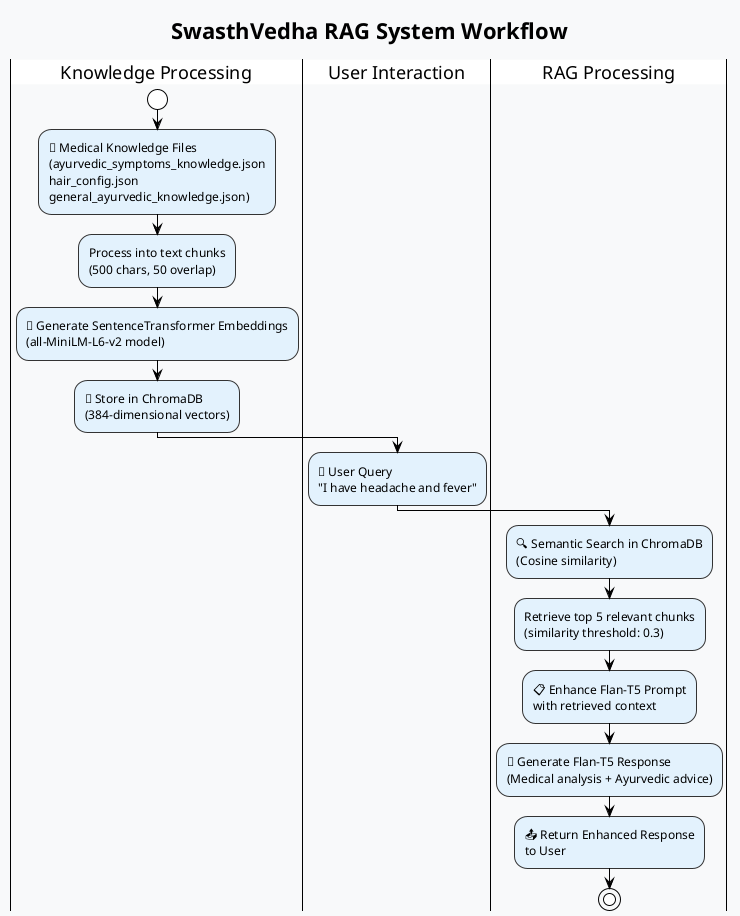
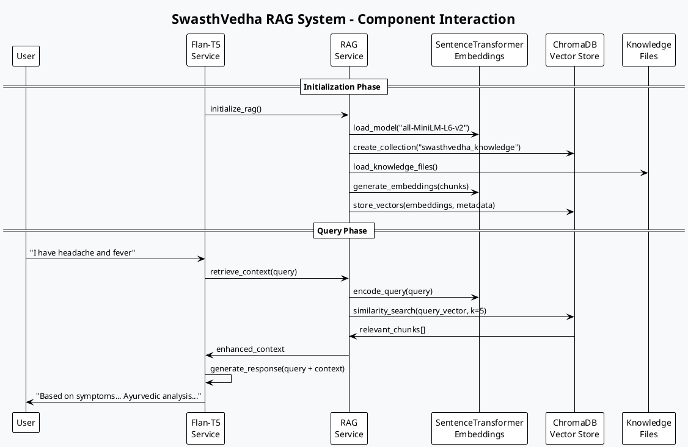
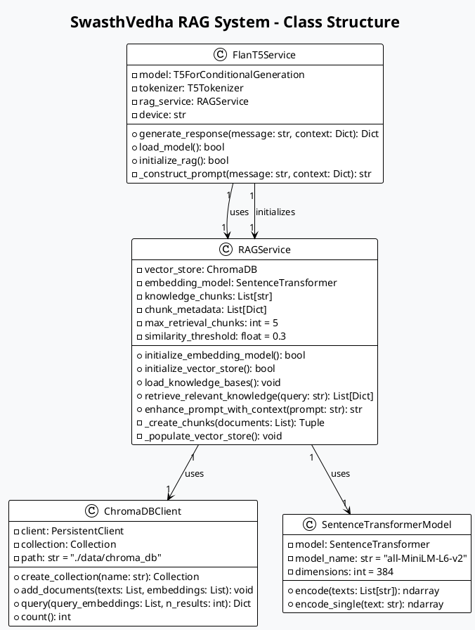
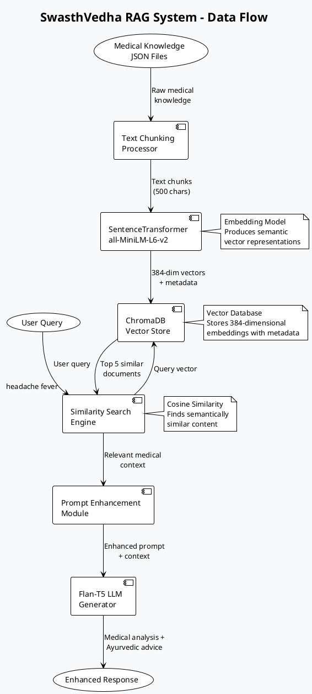
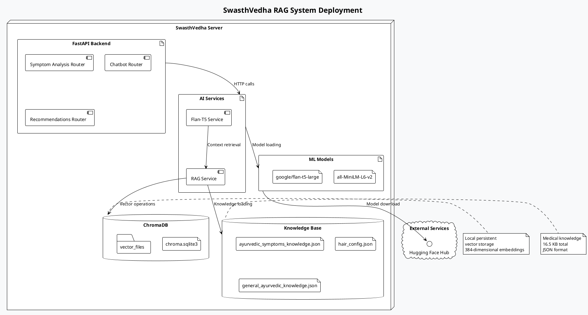

# SwasthVedha RAG System - UML Diagrams

## 1. Activity Diagram - RAG Workflow



## 2. Sequence Diagram - RAG Components Interaction



## 3. Component Diagram - System Architecture

```plantuml
@startuml RAG_Components
!theme plain
skinparam backgroundColor #f8f9fa

title SwasthVedha RAG System Architecture

package "SwasthVedha Backend" {
    
    component "Flan-T5 Service" as FlanT5 {
        port "generate_response" as gen
        port "initialize" as init
    }
    
    component "RAG Service" as RAGSvc {
        port "retrieve_context" as ret
        port "enhance_prompt" as enh
        port "load_knowledge" as load
    }
    
    component "Embedding Model" as Embed {
        interface "SentenceTransformer" as ST
        note right : all-MiniLM-L6-v2\n384 dimensions
    }
    
    component "Vector Database" as VectorDB {
        interface "ChromaDB" as CDB
        note right : Persistent storage\nCosine similarity\nSQLite backend
    }
    
    component "Knowledge Sources" as Knowledge {
        file "ayurvedic_symptoms_knowledge.json" as kb1
        file "hair_config.json" as kb2  
        file "general_ayurvedic_knowledge.json" as kb3
    }
    
    component "API Endpoints" as API {
        interface "REST" as rest
        note right : Symptoms analysis\nChatbot\nRecommendations
    }
}

' Connections
API::rest --> FlanT5::gen
FlanT5::init --> RAGSvc::load
FlanT5::gen --> RAGSvc::ret
RAGSvc::enh --> Embed::ST
RAGSvc::load --> VectorDB::CDB
RAGSvc::load --> Knowledge
Embed::ST --> VectorDB::CDB

@enduml
```

## 4. Class Diagram - RAG Service Structure



## 5. Data Flow Diagram - RAG Processing



## 6. Deployment Diagram - System Architecture



## Usage Instructions

### To Generate Diagrams:

1. **PlantUML Online**: 
   - Copy any diagram code above
   - Paste into [plantuml.com/plantuml](http://www.plantuml.com/plantuml)
   - Generate PNG/SVG

2. **VS Code Extension**:
   - Install "PlantUML" extension
   - Create `.puml` files with the code
   - Preview diagrams directly

3. **Local PlantUML**:
   ```bash
   # Install PlantUML
   npm install -g plantuml
   
   # Generate diagram
   plantuml diagram.puml
   ```

### Diagram Types Provided:

1. **Activity Diagram** - Shows the step-by-step RAG workflow
2. **Sequence Diagram** - Shows component interactions over time
3. **Component Diagram** - Shows system architecture and relationships
4. **Class Diagram** - Shows object-oriented structure
5. **Data Flow Diagram** - Shows how data moves through the system
6. **Deployment Diagram** - Shows physical system deployment

Each diagram provides a different perspective on your RAG system for documentation, presentations, or development planning.