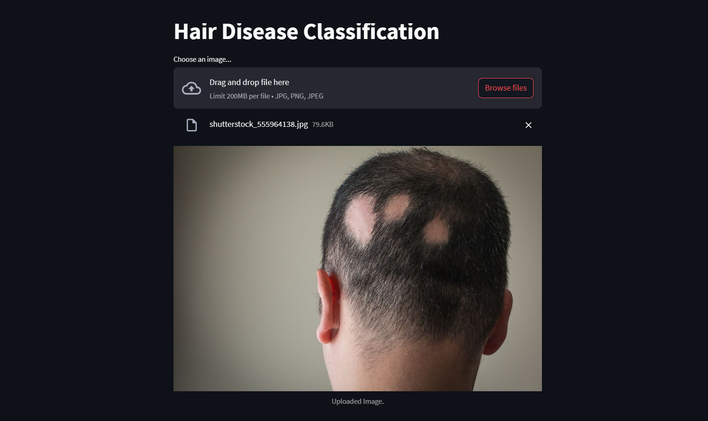
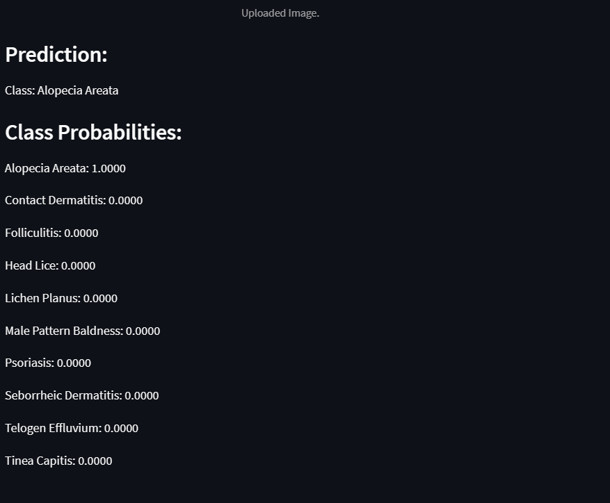

# Hair Disease Classification Using Pretrained Model

## Introduction
This repository contains the implementation of a machine learning project aimed at classifying hair diseases using a deep learning approach. With the advent of Convolutional Neural Networks (CNNs), image classification tasks have become more accessible and accurate. This project leverages a pretrained InceptionV3 model to differentiate between various hair diseases based on images, facilitating an educational tool and a preliminary step in diagnosing hair-related conditions.

## Project Description
The core of this project is a fine-tuned InceptionV3 model, a popular CNN architecture that has shown remarkable performance in image classification tasks. The model has been trained on a curated dataset that includes a variety of hair disease images. The goal is to classify an input image into one of several predefined categories of hair diseases.

## Dataset
The model was trained on a dataset obtained from Kaggle. The dataset comprises various images of hair diseases, which have been classified into several categories. You can access and download the dataset through the following link:

[Hair Diseases Dataset](https://www.kaggle.com/datasets/sundarannamalai/hair-diseases)

## Technologies Used
This project utilizes several technologies listed below:
- **Python**: The primary programming language used for both the machine learning model and the web application.
- **TensorFlow**: An open-source library for numerical computation and machine learning.
- **Keras**: A high-level neural networks API running on top of TensorFlow.
- **Streamlit**: An open-source app framework for Machine Learning and Data Science teams.
- **PIL**: Python Imaging Library for adding image processing capabilities to the Python interpreter.
- **NumPy**: A library for the Python programming language, adding support for large, multi-dimensional arrays and matrices.

## Setup and Installation
To set up this project locally, follow these steps:

1. Clone the repository to your local machine.
2. Ensure you have Python 3.8+ installed.
3. Install the required dependencies by running `pip install -r requirements.txt`.
4. Run the Streamlit web app using `streamlit run app3.py`.

## How to Use the Web App
To use the web application, follow these instructions:

1. Navigate to the hosted URL or run the app locally.
2. On the application page, click on the "Choose an image..." button.
3. Select an image from your computer that you want to classify.
4. The image will be automatically uploaded, and a preview will be displayed.
5. The app will process the image and display the predicted hair disease along with the probabilities of each class.

## Model Details
The InceptionV3 model used in this project is pretrained on ImageNet. We've adapted the model for our specific task by fine-tuning it on a hair disease dataset. The final layer of the model is a softmax layer that outputs the probabilities of each hair disease class.

### Data Preprocessing
Images are resized to 299x299 pixels and normalized as per the InceptionV3 requirements.

### Training and Evaluation
The model was trained using a split of training, validation, and test sets. Details about the training process, including loss function, optimizer, and evaluation metrics, are documented in the Jupyter notebook included in the repository.

## Prediction Results
After running the web app and uploading an image, you will receive a prediction result like this:

